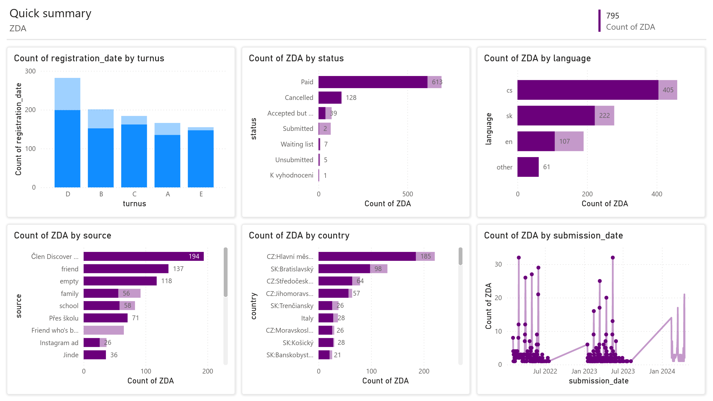

# ZDA - status prediction

### Situation

Byly mi poskytnuty data od letní akademie Discover za rok 2022, 2023 a část 2024. Data byla sbírána různými způsoby a je tedy potřeba je vyčistit a agregovat. Přihlášovací řízení probíhá ve 4 různých termínech a je potřeba předem alokovat volné sloty.

---

### Task

Hlavním úkolem této analýzy je předvídat zda-li student, který prošel výběrovým řízením a zruší svoji účast. Vznikají tak nadbytečná volná místa a je také potřeba vracet peníze. Druhotným úkolem je obecný přehled dat, pozorování letošních tendů a položení základů pro případné budoucí statistiky. 

---

### Action

1. **Čištění Dat**:
   - Identifikace a odstranění duplicitních záznamů
   - Oprava nebo odstranění chybějících nebo nesprávných hodnot
   - Celkový počet řádků po vyčištění činí 988

2. **Agregace Dat**:
   - Výběr pouze těch sloupců, které byly přítomny ve všech třech tabulkách
   - Sjednocení vybraných sloupců do jedné souhrnné tabulky
   - Kontrola konzistence a správnosti dat v nově vytvořené tabulce

3. **Importování dat do powerBI**:
   - Provést import do powerBI
   - Ověření smysluplnosti dat dle grafů

4. **Výběr vhodného algoritmu**:
   - Vztahy mezi daty nejsou lineární
   - Vzorek dat je relativně malý
   - Volíme tedy random forest classifier

5. **Implementace**:
   - Byl Použit python
   - Sci-kit learn
   - Pandas

6. **Ověření správnosti výsledků**:
   - Zamyšlení se nad výsledky a jejich smysluplností
   - Porovnání výsledků
---

### Results

Výsledkem je model, který má celkovou úspěnost ~76%.

Z classification reportu můžeme vidět, že detekce je v určitých případech poměrně úspěšná a u určitých méňe. To je dáno tím, že je vzorek rozdělen na trénovací a testovací data, nemá tudíž dostatečné množství záznamů s tímto 'statusem'. Nicméně je zde vidět, že class 3 (Paid) a class 4 (Cancelled) mají celkem dobrý percentil.

| Class | Precision | Recall | F1-Score | Support |\
|-------|-----------|--------|----------|---------|\
|   0   |   0.29    |  0.21  |   0.24   |    24   |\
|   1   |   0.50    |  0.11  |   0.18   |    55   |\
|   3   |   0.80    |  0.94  |   0.86   |   285   |\
|   4   |   0.82    |  0.88  |   0.85   |    26   |\
|   5   |   0.00    |  0.00  |   0.00   |     2   |\
|   6   |   0.00    |  0.00  |   0.00   |     4   |

##### Důležitost proměnných:
Dále jsou proměnné, které byly použity jako input features pro vyhodnocení statusu. Po konzultaci a cross-checku s vedoucím data týmu discover jsme zjistili, že důležitost těchto proměnných odpovídá realitě.

#
submission_date........33.8830%\
registration_date........23.8626%\
country.........................17.5304%\
source..........................11.8962%\
turnus.............................6.4433%\
language........................3.6967%\
past_participant............2.6878%
#

##### PowerBI report:

Dataset obsahuje i data z roku 2024, tedy aktuální data. Je zde vidět, že letos je větší zájem o turnus D.

### Comparison

Pro porovnání je zde práce, kde se autor snaží vyhodnotit zda-li student bude schopen dokončit titul na základě určitých proměnných. 

[Beaulac, C., Rosenthal, J.S. Predicting University Students’ Academic Success and Major Using Random Forests. Res High Educ 60, 1048–1064 (2019). https://doi.org/10.1007/s11162-019-09546-y]

Výsledek procentuální úspěšnosti modelu je podobný a zároveň je zde určitá podobnost ve velkém rozdílu úspěšnosti jednolivých classes.

---
### Conclusion

Ačkoliv je úspěšnost modulu ~76% poměrně vysoká, je zde stále prostor pro zlepšení. Zejména není dobré, že jsou v datech classy, které mají míň než 10 řádků. Také by se dala sbírát další data, která by mohla mít větší důležitost.
